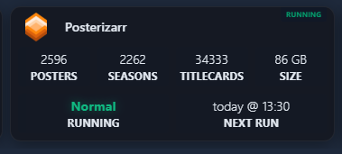
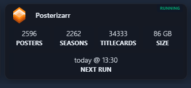

# Homepage Custom API Integration

You can integrate Posterizarr statistics into your [Homepage](https://gethomepage.dev/) dashboard using the `customapi` widget type. This allows you to display global stats or specific library stats directly on your dashboard.

## Identifying Library Indices

To map specific libraries or collections in the examples below, you need to know their index in the `folders` array returned by the API.

1. Open your browser and navigate to: `http://your-ip:8003/api/assets/stats?api_key=your_api_key`
2. You will see a JSON response like this:

```json
{
  "success": true,
  "stats": {
    "folders": [
      { "name": "Anime Shows", ... }, // Index [0]
      { "name": "TV Shows", ... },    // Index [1]
      { "name": "Kids Shows", ... },  // Index [2]
      ...
    ]
  }
}
```

3. Count the folders starting from **0**. For example:
    - The first folder is `stats.folders[0]`
    - The second folder is `stats.folders[1]`
    - ... and so on.

## Live Status & Global Asset Statistics (Recommended)

This configuration combines Docker health monitoring with dual `customapi` widgets to provide a comprehensive, real-time service card:
- **Docker Status:** Displays live container status (e.g. `RUNNING`) in the card header.
- **Asset Statistics (`/api/assets/stats`):** Shows real-time counts for Posters, Seasons, Titlecards, and total asset disk Size.
- **Scheduler & Run Monitor (`/api/dashboard/all`):** Shows the current active mode (`Running`) and the relative countdown to the next scheduled run (`Next Run`).

=== "Active Run (During Execution)"
    

=== "Idle (Between Runs)"
    

```yaml
- Posterizarr:
    icon: https://raw.githubusercontent.com/fscorrupt/posterizarr/main/docs/images/Logo_Posterizarr.png
    href: https://posterizarr.your-domain.com # or http://your-ip:8003
    server: my-docker # Optional: matches your docker provider in Homepage's docker.yaml
    container: posterizarr # Optional: docker container name for live status badge
    widgets:
      - type: customapi
        url: http://your-ip:8003/api/assets/stats?api_key=your_api_key
        display: block
        mappings:
          - field: stats.posters
            label: Posters
          - field: stats.seasons
            label: Seasons
          - field: stats.titlecards
            label: Titlecards
          - field: stats.total_size
            label: Size
            format: bytes
      - type: customapi
        url: http://your-ip:8003/api/dashboard/all?api_key=your_api_key
        display: block
        mappings:
          - field: status.current_mode
            label: Running
          - field: scheduler_status.next_run
            label: Next Run
            format: date
            timeStyle: short
            locale: de-DE # Optional: adjust to your locale (e.g. en-US, de-DE) or use format: relativeDate
```

## Overall Assets & Stats

This example shows how to combine both the `overview` (for missing assets) and `stats` (for counts) endpoints in a single service block using YAML anchors for a cleaner configuration.

!!! warning "Index may differ"
    This example uses `stats.folders[8]` for Collections. Please look at [Identifying Library Indices](#identifying-library-indices) to find the correct index for your system.


```yaml
- Posterizarr:
    - Assets:
        icon: https://github.com/fscorrupt/posterizarr/blob/main/docs/images/Logo_Posterizarr.png?raw=true
        widgets:
          - type: customapi
            url: http://your-ip:8003/api/assets/overview?api_key=your_api_key
            display: block
            mappings:
              - field: categories.missing_assets.count
                label: Missing

          - &stats_api
            type: customapi
            url: http://your-ip:8003/api/assets/stats?api_key=your_api_key
            display: block
            mappings:
              - field: stats.posters
                label: Posters
              - field: stats.folders[8].poster_count
                label: Collections
              - field: stats.seasons
                label: Seasons

          - <<: *stats_api
            display: block
            mappings:
              - field: stats.backgrounds
                label: Backgrounds
              - field: stats.titlecards
                label: Titlecards
              - field: stats.total_size
                label: Size
                format: bytes
```

## Global Statistics

To display overall statistics (Total Posters, Seasons, etc.), use the following configuration in your `services.yaml`:


```yaml
- Posterizarr Assets:
    icon: https://github.com/fscorrupt/posterizarr/blob/main/docs/images/Logo_Posterizarr.png?raw=true
    widget:
      type: customapi
      url: http://your-ip:8003/api/assets/stats?api_key=your_api_key
      display: list
      mappings:
        - field: stats.posters
          label: Total Posters
        - field: stats.backgrounds
          label: Total Backgrounds
        - field: stats.seasons
          label: Total Seasons
        - field: stats.titlecards
          label: Total Titlecards
        - field: stats.folders[8].poster_count
          label: Total Collections
        - field: stats.total_size
          label: Total Size
          format: bytes
```

### Docker Labels Configuration

If you prefer to configure Homepage automatically via Docker labels instead of manually editing `services.yaml`, you can add the following labels to your Posterizarr container:

```yaml
      - homepage.name=Posterizarr
      - homepage.icon=sh-posterizarr
      - homepage.href=${POSTERIZARR_URL}
      - homepage.siteMonitor=${POSTERIZARR_URL}
      - homepage.widget.type=customapi
      - homepage.widget.url=${POSTERIZARR_URL}/api/assets/stats?api_key=${POSTERIZARR_KEY}
      - homepage.widget.display=block
      - homepage.widget.mappings[0].field=stats.posters
      - homepage.widget.mappings[0].label=Posters
      - homepage.widget.mappings[1].field=stats.seasons
      - homepage.widget.mappings[1].label=Seasons
      - homepage.widget.mappings[2].field=stats.titlecards
      - homepage.widget.mappings[2].label=Titlecards
      - homepage.widget.mappings[3].field=stats.total_size
      - homepage.widget.mappings[3].label=Size
      - homepage.widget.mappings[3].format=bytes
```

## Library-Specific Statistics

You can also create separate widgets for each of your libraries (Anime, TV Shows, Movies, etc.).

### Example: Library Widgets

Here is an example configuration for multiple libraries using YAML anchors for efficiency:


```yaml
- Posterizarr:
    - Anime Shows:
        widget: &lib_base  # <--- This defines the "lib_base" anchor
          type: customapi
          url: http://your-ip:8003/api/assets/stats?api_key=your_api_key
          mappings:
            - field: stats.folders[0].poster_count
              label: Posters
            - field: stats.folders[0].season_count
              label: Seasons
            - field: stats.folders[0].titlecard_count
              label: Titlecards
            - field: stats.folders[0].size
              label: Size
              format: bytes

    - TV Shows:
        widget:
          <<: *lib_base
          mappings:
            - field: stats.folders[1].poster_count # Only override the field index
              label: Posters
            - field: stats.folders[1].season_count
              label: Seasons
            - field: stats.folders[1].titlecard_count
              label: Titlecards
            - field: stats.folders[1].size
              label: Size
              format: bytes

    - Movies:
        widget:
          <<: *lib_base
          mappings:
            - field: stats.folders[3].poster_count
              label: Posters
            - field: stats.folders[3].size
              label: Size
              format: bytes

    - 4K TV Shows:
        widget:
          <<: *lib_base
          mappings:
            - field: stats.folders[5].poster_count
              label: Posters
            - field: stats.folders[5].season_count
              label: Seasons
            - field: stats.folders[5].titlecard_count
              label: Titlecards
            - field: stats.folders[5].size
              label: Size
              format: bytes
```

### Example: Collections Widget

Since the index for Collections varies between systems, you must first identify it using the guide above. If your Collections are at index `[8]`, your configuration would look like this:

```yaml
- Posterizarr:
    - Collections:
        widget:
          type: customapi
          url: http://your-ip:8003/api/assets/stats?api_key=your_api_key
          mappings:
            - field: stats.folders[8].poster_count
              label: Collection Posters
            - field: stats.folders[8].size
              label: Size
              format: bytes
```

## Custom CSS Styling (Dark Glassmorphism)

To achieve the sleek, modern glassmorphic look shown in the screenshots, Homepage allows adding a custom stylesheet via `custom.css` in your Homepage `/config` directory.

Add the following styles to `/config/custom.css`:

```css
/* ==============================================================================
   Homepage Custom Aesthetic Styles
   Inspired by Dark Minimalist Glassmorphic Dashboard Design
   ============================================================================== */

/* Base & Background */
body {
  background-color: #0b0c10 !important;
  color: #e2e8f0 !important;
  font-family: -apple-system, BlinkMacSystemFont, "Segoe UI", Roboto, "Helvetica Neue", Arial, sans-serif !important;
  -webkit-font-smoothing: antialiased !important;
}

/* Tab Bar Navigation (Centered sleek pills) */
nav[role="tablist"],
div[role="tablist"],
.tabs-container {
  display: flex !important;
  justify-content: center !important;
  gap: 0.5rem !important;
  margin-top: 0.25rem !important;
  margin-bottom: 1.5rem !important;
}

/* Tab buttons */
nav[role="tablist"] a,
nav[role="tablist"] button,
div[role="tablist"] a,
div[role="tablist"] button {
  border-radius: 8px !important;
  padding: 0.45rem 2.2rem !important;
  font-weight: 500 !important;
  font-size: 0.95rem !important;
  transition: all 0.2s cubic-bezier(0.4, 0, 0.2, 1) !important;
  border: 1px solid rgba(255, 255, 255, 0.05) !important;
}

/* Service Cards - Dark Glassmorphism */
.service-card,
div[class*="group relative flex flex-col"],
div[class*="rounded-lg"][class*="border"] {
  background: rgba(18, 20, 26, 0.72) !important;
  backdrop-filter: blur(14px) !important;
  -webkit-backdrop-filter: blur(14px) !important;
  border: 1px solid rgba(255, 255, 255, 0.06) !important;
  border-radius: 12px !important;
  box-shadow: 0 4px 16px rgba(0, 0, 0, 0.35) !important;
  transition: transform 0.2s ease, border-color 0.2s ease, box-shadow 0.2s ease !important;
}

/* Service Card Hover Effect */
.service-card:hover,
div[class*="group relative flex flex-col"]:hover {
  transform: translateY(-2px) !important;
  border-color: rgba(255, 255, 255, 0.15) !important;
  box-shadow: 0 8px 24px rgba(0, 0, 0, 0.5) !important;
}

/* Category & Group Headers */
h2, .group-title, div[class*="font-semibold text-"] {
  letter-spacing: 0.03em !important;
  font-weight: 600 !important;
}

/* Status & Ping Indicators (Neon emerald glow) */
.ping,
div[class*="rounded-full"][class*="bg-emerald-"],
div[class*="rounded-full"][class*="bg-green-"] {
  box-shadow: 0 0 8px rgba(16, 185, 129, 0.4) !important;
}
```

### Clean Formatting & Auto-Hide (Optional `custom.js`)

If you want the "Running" state indicator to automatically hide when Posterizarr is idle (leaving a clean centered "Next Run" display as shown in the screenshot), format friendly execution modes (e.g., `LogoUpdater`, `Normal`, `Arr / Recent`, `Tautulli`), and display clean countdown dates like `today @ 13:30` or `tomorrow @ 04:00`, add this script to `/config/custom.js`:

```javascript
// ==============================================================================
// Homepage Custom Scripts - Posterizarr Clean Formatting & Auto-Hide
// File: /config/custom.js
// ==============================================================================

const monthMap = {
  januar: 0, jan: 0, january: 0,
  februar: 1, feb: 1, february: 1,
  märz: 2, maerz: 2, mar: 2, march: 2,
  april: 3, apr: 3,
  mai: 4, may: 4,
  juni: 5, jun: 5, june: 5,
  juli: 6, jul: 6, july: 6,
  august: 7, aug: 7,
  september: 8, sep: 8, sept: 8,
  oktober: 9, okt: 9, oct: 9, october: 9,
  november: 10, nov: 10,
  dezember: 11, dez: 11, dec: 11, december: 11
};

function parseDateAny(str) {
  if (!str) return null;
  // 1. Standard ISO or date parse
  const d = new Date(str);
  if (!isNaN(d.getTime())) return d;

  // 2. German/localized date string (e.g. "17. September 2026 um 13:30")
  const m = str.match(/(\d{1,2})\.\s*([a-zA-ZäöüÄÖÜ]+)\s*(\d{4})[^\d]*(\d{1,2}):(\d{2})/);
  if (m) {
    const day = parseInt(m[1], 10);
    const mStr = m[2].toLowerCase();
    const month = monthMap[mStr] !== undefined ? monthMap[mStr] : 8;
    const year = parseInt(m[3], 10);
    const hour = parseInt(m[4], 10);
    const min = parseInt(m[5], 10);
    return new Date(year, month, day, hour, min);
  }
  return null;
}

function formatFriendlyNextRun(rawStr) {
  if (!rawStr) return rawStr;
  if (/^(today|tomorrow|on\s+[A-Za-z]+)\s*@/i.test(rawStr)) return rawStr;

  const timeMatch = rawStr.match(/(\d{1,2}):(\d{2})/);
  const timeStr = timeMatch ? `${timeMatch[1].padStart(2, '0')}:${timeMatch[2]}` : '';
  const target = parseDateAny(rawStr);

  if (!target) {
    return timeStr ? `today @ ${timeStr}` : rawStr;
  }

  const now = new Date();
  const targetMidnight = new Date(target.getFullYear(), target.getMonth(), target.getDate());
  const nowMidnight = new Date(now.getFullYear(), now.getMonth(), now.getDate());
  const diffDays = Math.round((targetMidnight.getTime() - nowMidnight.getTime()) / (1000 * 60 * 60 * 24));

  if (diffDays === 0) {
    return `today @ ${timeStr}`;
  } else if (diffDays === 1) {
    return `tomorrow @ ${timeStr}`;
  } else if (diffDays > 1 && diffDays < 7) {
    const days = ['Sun', 'Mon', 'Tue', 'Wed', 'Thu', 'Fri', 'Sat'];
    return `on ${days[target.getDay()]} @ ${timeStr}`;
  } else if (diffDays < 0) {
    return `today @ ${timeStr}`;
  } else {
    const months = ['Jan', 'Feb', 'Mar', 'Apr', 'May', 'Jun', 'Jul', 'Aug', 'Sep', 'Oct', 'Nov', 'Dec'];
    return `${target.getDate()}. ${months[target.getMonth()]} @ ${timeStr}`;
  }
}

function formatModeName(mode) {
  if (!mode) return '';
  const lower = mode.toLowerCase();
  if (lower === 'logoupdater') return 'LogoUpdater';
  if (lower === 'normal') return 'Normal';
  if (lower === 'tautulli') return 'Tautulli';
  if (lower === 'arr') return 'Arr / Recent';
  if (lower === 'manual') return 'Manual';
  if (lower === 'syncjelly') return 'Sync Jellyfin';
  if (lower === 'syncemby') return 'Sync Emby';
  if (lower === 'backup') return 'Backup';
  if (lower === 'testing') return 'Testing';
  if (lower === 'scheduled') return 'Scheduled';
  return mode.charAt(0).toUpperCase() + mode.slice(1);
}

function handlePosterizarrCard() {
  const blocks = document.querySelectorAll('.service-block, div[class*="service-block"]');
  blocks.forEach((block) => {
    // Find all leaf text nodes inside this block
    const leafNodes = Array.from(block.querySelectorAll('*')).filter(
      (el) => el.children.length === 0 && el.textContent.trim().length > 0
    );
    if (leafNodes.length < 2) return;

    // Identify the label element
    const labelEl = leafNodes.find((el) => {
      const t = el.textContent.trim().toUpperCase();
      return t === 'RUNNING' || t === 'MODE' || t === 'NEXT RUN' || t === 'NÄCHSTER LAUF';
    });
    if (!labelEl) return;

    const valueEl = leafNodes.find((el) => el !== labelEl);
    if (!valueEl) return;

    const labelText = labelEl.textContent.trim().toUpperCase();
    const rawVal = valueEl.textContent.trim();

    // 1. RUNNING BADGE: Hide if idle, style in emerald green if active
    if (labelText === 'RUNNING' || labelText === 'MODE') {
      const isIdle = !rawVal || rawVal === '-' || rawVal === 'null' || rawVal === 'false' || rawVal === '—';
      if (isIdle) {
        block.style.setProperty('display', 'none', 'important');
      } else {
        block.style.removeProperty('display');
        valueEl.style.color = '#10b981';
        valueEl.style.fontWeight = 'bold';
        valueEl.style.textShadow = '0 0 10px rgba(16, 185, 129, 0.4)';
        valueEl.textContent = formatModeName(rawVal);
      }
    }

    // 2. NEXT RUN BADGE: Clean format (today @ 13:30, tomorrow @ 13:30, on Sat @ 13:30)
    if (labelText === 'NEXT RUN' || labelText === 'NÄCHSTER LAUF') {
      const formatted = formatFriendlyNextRun(rawVal);
      if (formatted && formatted !== rawVal) {
        valueEl.textContent = formatted;
      }
    }
  });
}

let isRunning = false;
function runCustomScripts() {
  if (isRunning) return;
  isRunning = true;
  try {
    handlePosterizarrCard();
  } finally {
    setTimeout(() => {
      isRunning = false;
    }, 100);
  }
}

// Run immediately and observe DOM updates
if (typeof window !== "undefined") {
  if (document.readyState === "loading") {
    document.addEventListener("DOMContentLoaded", runCustomScripts);
  } else {
    runCustomScripts();
  }

  // Periodic check (every 500ms for first 5 seconds) to handle SWR background hydration
  let checkCount = 0;
  const interval = setInterval(() => {
    runCustomScripts();
    if (++checkCount > 10) clearInterval(interval);
  }, 500);

  const observer = new MutationObserver(() => {
    runCustomScripts();
  });

  observer.observe(document.body, { childList: true, subtree: true });
}
```

## Available Fields

### Asset Statistics (`/api/assets/stats`)

| Field | Description |
| :--- | :--- |
| `stats.posters` | Total number of posters across all libraries |
| `stats.seasons` | Total number of season posters |
| `stats.titlecards` | Total number of titlecards |
| `stats.backgrounds` | Total number of backgrounds |
| `stats.total_size` | Total size of all assets in bytes (use `format: bytes`) |
| `stats.folders[X].poster_count` | Number of posters in a specific library folder |
| `stats.folders[X].background_count` | Number of backgrounds in a specific library folder |
| `stats.folders[X].season_count` | Number of seasons in a specific TV folder |
| `stats.folders[X].titlecard_count` | Number of titlecards in a specific library folder |
| `stats.folders[X].size` | Size of assets in bytes for a specific folder |
| `stats.folders[X].total_count` | Total file count for a specific folder |

### Dashboard & Scheduler (`/api/dashboard/all`)

| Field | Description |
| :--- | :--- |
| `status.current_mode` | Currently running mode (`manual`, `scheduler`, etc.) or `-`/`null` when idle |
| `scheduler_status.next_run` | Timestamp of the next scheduled run (use `format: relativeDate`) |
| `scheduler_status.enabled` | Boolean indicating if the background scheduler is active |
| `status.running` | Boolean indicating if any script process is actively running |
| `version.local` | Currently installed version |
| `version.is_update_available` | Boolean indicating if an update is available |

!!! tip
    Use `format: bytes` in Homepage mappings for any field representing file size (e.g., `stats.total_size` or `size`) to ensure it displays in human-readable units (e.g., GB or MB). For timestamp fields like `scheduler_status.next_run`, use `format: relativeDate` to display dynamic counters like `in 8 minutes`.
